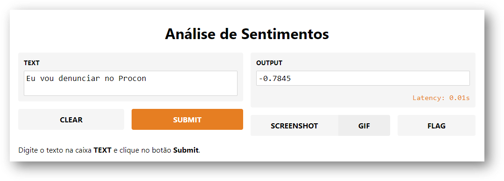
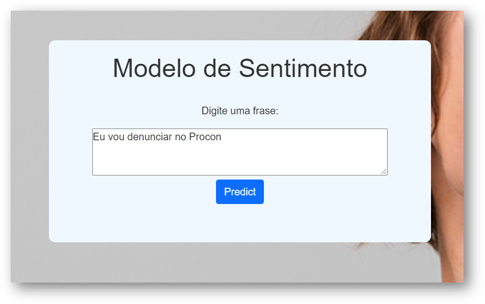
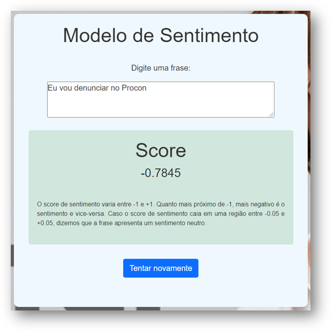

# Modelo de Sentimento

## Gradio
Para experimentar o modelo: [https://gradio.app/g/joaopcnogueira/sentiment-model](https://gradio.app/g/joaopcnogueira/sentiment-model)

## FastAPI
Há também um aplicativo construído com FastAPI. 

## Exemplos

1. Frases Negativas
    - péssimo atendimento
    - eu vou denunciar vocês
    - eu vou denunciar vocês no procon
    - eu abri um chamado no reclame aqui
    - tu é uma merda
    - Quero falar com uma pessoa
    - voce nao consegue resolver o meu caso
    - fui cobrado duas vezes
    - duas cobranças indevidas

2. Frases Positivas
    - Muito obrigado pelo atendimento
    - Parabéns pelo atendimento

3. Neutras
    - Eu gostaria de solicitar a segunda fatura